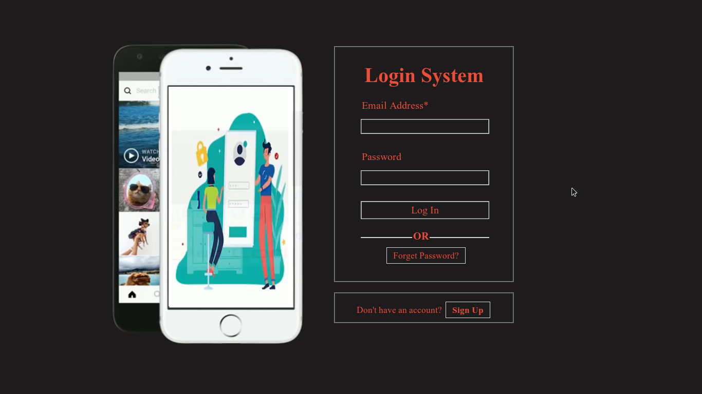
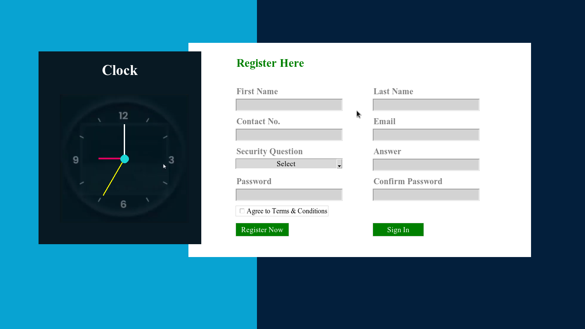

# login-registration

Login Registration applications made using Python3 and Tkinter Module

Description
=============

Login and Registartion applications made with simple design patterns yet has all the essential functionality like storing and resetting login details using database(mysql).Two different designs and color schemes available with both the applications.

 
Features
=========
*Animated Login form with images 
*Two differently designed applications with same functionality 
*Forget Password functionality was made available 

Usage
=======
*Install Python3 and Install tkinter,pillow,mysql modules 
*Create mysql username and password and create required databases and tables 
*Replace database,table names and username,passwords 
*Execute .py files accordingly 

